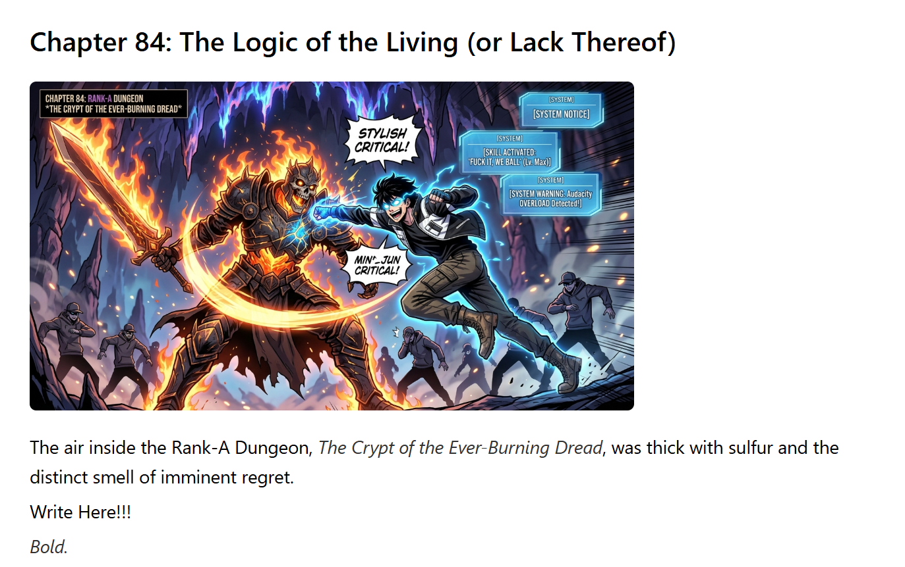
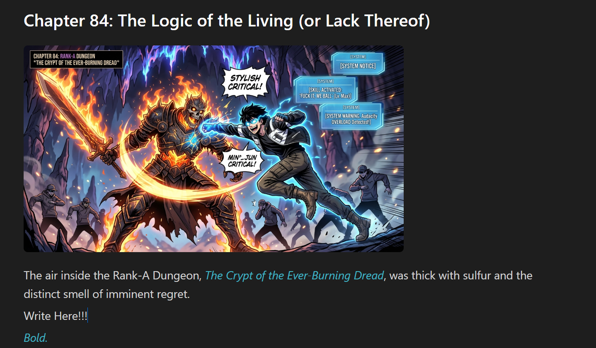

<p align="center">
  
</p>

<h1 align="center">Yesss Editor</h1>

<p align="center">A minimal, distraction-free Markdown editor with inline preview, built with Tauri and TipTap. Lightweight and cross-platform — runs on Windows, macOS, and Linux.</p>

<p align="center">
  
  
  
</p>

---

## Features

- **Rich text editing** — Bold, italic, underline, strikethrough, headings, lists, blockquotes, inline code, and links
- **Bubble menu toolbar** — Formatting toolbar appears on text selection
- **Image support** — Paste, drag & drop, or insert images directly into your document
- **Image preview** — Full-screen gallery with navigation between images
- **Command palette** — Quick file search with fuzzy matching (`Ctrl + \`)
- **Zen mode** — Fullscreen distraction-free writing (`Ctrl + Shift + F`)
- **Theming** — 5 built-in themes: Light, Dark, Catppuccin, Espresso, Tokyo Night
- **Customizable font size** — Adjustable with keyboard shortcuts
- **Adjustable editor width** — Resize the editor area on the fly
- **Unsaved changes guard** — Prompts to save before closing or switching files
- **Word & character count** — Live statistics in the info panel
- **Native file dialogs** — Open, save, and save-as with system dialogs

## Screenshots

<p align="center">
  
  &nbsp;&nbsp;
  
</p>

## Video

https://github.com/dimm999/Yesss-Editor/assets/video.mp4

## Shortcuts

| Shortcut | Action |
|---|---|
| `Ctrl + N` | New file |
| `Ctrl + O` | Open file |
| `Ctrl + Shift + O` | Open folder |
| `Ctrl + S` | Save file |
| `Ctrl + Q` | Quit |
| `Ctrl + \` | Command palette |
| `Ctrl + Shift + F` | Toggle zen mode (fullscreen) |
| `Ctrl + =` | Increase font size |
| `Ctrl + -` | Decrease font size |
| `Ctrl + 0` | Reset font size |
| `Ctrl + ;` | Decrease editor width |
| `Ctrl + '` | Increase editor width |
| `Ctrl + [` | Previous theme |
| `Ctrl + ]` | Next theme |
| `Ctrl + /` | Toggle info panel |

## Installation

### Download

Download the latest release from the [Releases](https://github.com/dimm999/Yesss-Editor/releases) page.

### Build from source

**Prerequisites:**
- [Node.js](https://nodejs.org/) (v18+)
- [Rust](https://www.rust-lang.org/tools/install)
- [Tauri CLI](https://v2.tauri.app/start/prerequisites/)

```bash
# Clone the repository
git clone https://github.com/dimm999/Yesss-Editor.git
cd Yesss-Editor

# Install dependencies
npm install

# Development
npm run tauri dev

# Build for production
npm run tauri build
```

## Tech Stack

- [Tauri](https://tauri.app/) v2 — Native desktop framework
- [React](https://react.dev/) v19 — UI library
- [TipTap](https://tiptap.dev/) — Rich text editor
- [Vite](https://vitejs.dev/) — Build tool
- [TypeScript](https://www.typescriptlang.org/) — Type safety

## License

MIT
